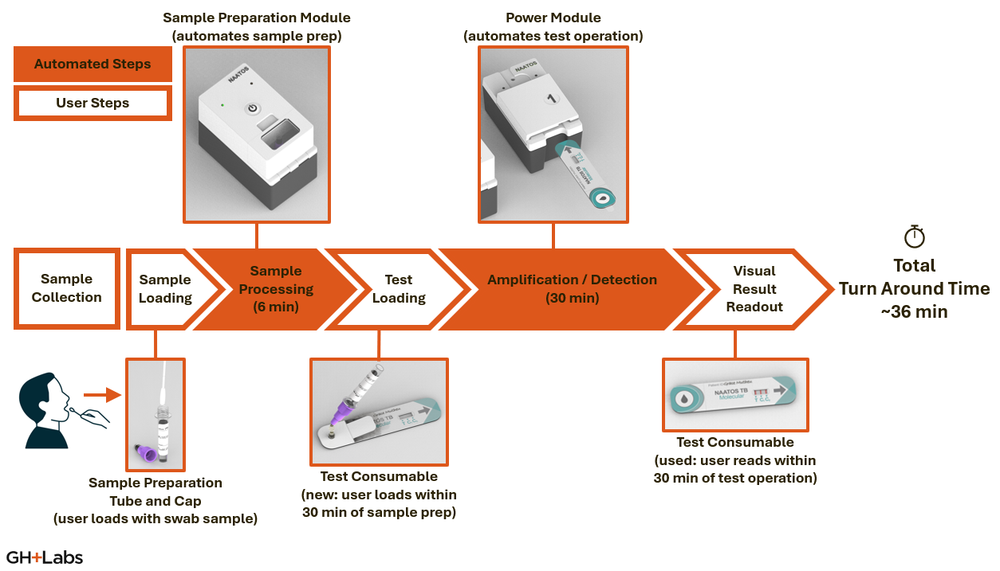

# NAATOS TB V1

## Overview

<table>
<tr><th colspan="2">NAATOS TB V1 Product Overview</th></tr>
<tr><td>Indication for use</td>
    <td><ul><li>The NAATOS TB diagnostic test performed with the NAATOS Modular System is a qualitative <em>in vitro</em> diagnostic test for the genetic detection of <em>Mycobacterium tuberculosis</em> (Mtb) complex DNA in raw tongue swab specimens collected from individuals (2 years of age or older) who are suspected of having active pulmonary TB</li></ul></td>
</tr>
<tr><td>Specimen type</td>
    <td><ul><li>Tongue swab</li></ul></td>
</tr>
<tr><td>Setting</td>
    <td><ul><li>Diverse healthcare settings, including primary healthcare facilities, rural clinics, and remote areas with limited access to laboratory infrastructure (e.g. mobile clinics)</li></ul></td>
</tr>
<tr><td>Intended users</td>
    <td><ul><li>Health care workers in primary health clinics</li></ul></td>
</tr>
<tr><td>Novel components</td>
    <td><ul><li>Sample Prep Module: Battery-powered (USB rechargeable), portable, benchtop device designed to efficiently extract genetic material from <em>M. mycobacteria</em> in tongue swab samples</li>
    <li>Power Module: Battery-powered (USB rechargeable), portable, benchtop device designed to operate for the processing of extracted samples (from sample prep module) with a NAATOS test device</li>
    <li>Test Consumable: Low-cost cartridge that embeds nucleic acid amplification chemistry on a lateral flow strip (for visual read-out); and manages user interactions, reagent storage, and fluid and air transport and containment within its novel multi-layered laminate structure</li></ul></td>
</tr>
<tr><td>Key features</td>
    <td><ul><li>PCR-level performance with isothermal Loop-mediated Amplification (LAMP) chemistry</li>
    <li>< 35 minute test turn-around-time</li>
    <li>No cold chain storage</li>
    <li> > 18 months shelf life for consumables</li></ul></td>
</tr></table>

## System Design

The NAATOS TB V1 is a modular diagnostic system comprising five components:

- Two reusable, portable, battery-powered modules

    ---

    - [Sample Preparation Module (SPM)](#sample-preparation-module-spm)
    - [Power Module (PM)](#power-module-pm)

- Three disposable, single-use consumables in a kit

    ---

    - [Sample Collection Consumable (SCC)](#sample-collection-consumable-scc)
        (tongue swab)

    - [Sample Preparation Tube (SPT)](#sample-preparation-tube-spt)
        (dropper tube)

    - [Test Consumable (TC)](#test-consumable-tc)

A minimum of one Sample Prep Module and one Power module are required to operate the system. As desired, additional Sample Prep Modules and Power Modules may be added to increase system throughput. The Sample Prep module takes less time to perform its function than the Power Module, such that a single Sample Prep Module and six Power Modules would operate at approximately 100% duty cycle. The Sample Prep Module and Power Module contain electronics and batteries and should be disposed of as e-waste if non-functional.

A minimum of one consumables kit is required to operate the system. The tongue swab is used to collect a dorsal tongue swab specimen. The dropper tube is used to sample the specimen, process the sample, and transfer the processed sample to the test device. The test device is used to assay the processed sample for DNA sequences released from Mycobacterium tuberculosis bacteria and visualize the assay result. All consumables may be disposed of as regular waste and do not contain electronics or hazardous materials. All reagents are contained within the sealed components.

### Sample Collection Consumable (SCC)

A single-use, off-the-shelf swab for sampling a dorsal tongue specimen.

The tongue swab is a sterile flocked swab tip on a shaft with an integral break point.

### Sample Preparation Tube (SPT)

A single-use, off-the-shelf squeezable dropper tube for holding sample preparation reagents and swab head during sample preparation, and transferring prepared sample to test consumable.

The dropper tube consists of a polyethylene tube body; a two-part cap, in which a smaller dispensing cap that screws on to a larger tube cap comprise the two-part cap that screws onto the tube body; and a filter placed within the tube cap below the dispensing cap. The tube body is pre-filled with glass microbeads and a buffer, and foil-sealed to protect against evaporation and contamination. The tube body is flexible to allow dispensing of liquid, through the dispensing end of the attached tube cap when the dispensing cap is removed, by squeezing with the fingertips.

### Sample Preparation Module (SPM)

A reusable, custom, portable instrument for preparing swab sample in sample tube. Also explore the [Near-Point-Of-Care Bead-Beater (nPOC-BB) project](https://global-health-labs.github.io/nPOC-BB){:target="_blank"}.

The SPM design  is intended to minimize overall system cost of a thermally enhanced bead-beating approach to sample preparation while meeting all requirements. The SPM has a three-part housing (hinged lid, bottom, and top), which is meant to be compatible with low-cost injection molding processes. The SPM has subcomponents, such as a primary printed circuit boards, battery packs, motor, hinge, magnets, and a heated shaking mechanism, that are mounted to the housing prior to assembly. The SPM also has subcomponents, such as a button, a switch, battery packs, and a secondary printed circuit board, that are connected by wires or cables to the primary printed circuit board prior to assembly.

- The SPM heats the sample to 95 °C to render it biosafe and inactivate nuclease activity from the tongue swab, and shakes the sample in the presence of heat, glass beads, and buffer to lyse the TB cells and release their nucleic acids for amplification. The shaking induces relative motion between the cells and glass beads while in fluid, and the resulting viscous shear forces tear the cell wall and release the nucleic acid into suspension in the buffer.
- The SPM includes a lid to safely enclose the process of heating and shaking the dropper tube
- The SPM includes a power switch to toggle electrical connection of the battery and a start/stop button to toggle the processing sequence.
- The SPM contains internal batteries that allow it to run while disconnected from external power. The batteries are charged by a USB-C port and power monitoring is included to ensure that a run will have enough battery power to complete.
- The SPM includes a control board that manages power inside the module, controls the heating and shaking mechanisms, senses the open/closed state of the lid, and uses two RGB LEDs to guide the user through the processing sequence and to indicate events, states, modes, transitions, and/or alerts.

### Test Consumable (TC)

A single-use, custom, laminated test cartridge for holding assay reagents and running assay from prepared sample.

The TC design is intended to minimize overall system cost of an automated, combined isothermal nucleic acid amplification reaction and lateral flow assay while meeting all requirements. The test device comprises a laminate housing, which is converted from plastic and adhesive sheets or rolls and pressed together into upper and lower laminate subcomponents; and a lateral flow strip, which is assembled from several porous materials, some of which have been modified with buffers and/or dried with biochemical reagents. The manufacturing sequence provides that the lateral flow strip subcomponent and the upper and lower laminate housing subcomponents are combined in a final assembly step to create the test device.

- The test device consists of a specialized lateral flow assay (LFA) strip and a laminated housing.
- The LFA strip provides several functionalities: sample metering, fluid transport via capillary flow, amplification and detection reagent dry storage, automated two-step valved transfer from amplification to detection, and a diagnostic readout. These functionalities are enabled by various treated and untreated porous materials used—in order from upstream to downstream—as distributer, amplification, wax valve, conjugate, analytical, and waste pads.
- The distributor pad is placed upstream of and overlaps the amplification pad. It provides a low-resistance flow medium to transport the fluid sample out of the sample well and up to the wax valve then down into the amplification pad. The transport speed in the distributor pad is greater than in the amplification pad, where the latter is affected by the excipients used to dry the amplification reagents in the amplification pad. This phenomenon causes the sample to preferentially wet the entire distributor pad before flowing down to wet the entire amplification pad from above, improving the uniformity of reagent rehydration in the amplification pad.
- The amplification pad contains the dry amplification reagents, including an Internal Positive Control (IPC), and is the location for the loop-mediated amplification (LAMP) reaction. During amplification, the PM heats the amplification pad and wax valve pad to the amplification temperature of 65 °C.
- The wax valve pad contains a solid stripe of casting wax deposited by striping melted wax on two sides of the wax valve pad material and reflowing the double-striped valve in an oven. After amplification, the PM rapidly heats the wax valve to 90 °C, which melts the valve such that the liquid amplification reaction flows downstream to the test lines. The wax valve requires both a minimum temperature to actuate as well as a minimum input power level. Low input power levels reduce performance by allowing partial melting that reduces downstream flow performance.
- The conjugate pad contains one of the dry detection reagents. This reagent is the blue latex nanoparticle and anti-FITC antibody conjugate that visibly labels the amplification reaction product.
- The analytical pad enables visual interpretation of the assay, and include a test line, internal positive control line, and flow control line. These lines contain the rest of the dry detection reagents, which capture the amplification reaction product stemming from the target nucleic acid sequence (i.e., Mtb IS6110 and IS1080 genome sites), the amplification reaction product stemming from the IPC (i.e., a plasmid containing a partial sequence of the EF-1α gene from Valsa mali, a fungal apple pathogen), and unbound conjugates, respectively.
- The waste pad accepts all fluid transported through the analytical pad, which allows for clearance of uncaptured conjugate from the analytical pad, enabling easier visual interpretation.
- The laminated housing provides the mechanical structure to enable error-free introduction of prepared sample, to hold the LFA strip, to seal the amplification reaction behind the wax valve, to allow air recirculation during detection, and to provide a biosafe enclosure. The laminate is made of interlaid layers of plastic sheeting and pressure sensitive adhesives, which convert 2D sections into a 3D layout that implements these functions.
- The sample introduction zone contains a plastic tab above a backed adhesive seal with an inlet port, which is terminated by a positive stop feature within a sample well that guides fluid into the upstream end (i.e., distributor pad) of the LFA. The inlet port is only slightly larger than the dispensing end of the dropper tube to minimize the risk of sample escaping the test device during sample introduction from the dropper tube to the test device.
- The amplification zone is tight to the LFA to discourage capillary flow out of the amplification zone. The lowest layer of the laminate is designed to allow efficient heat transfer to the amplification zone and wax valve.
- The wax valve zone is tight to the wax valve in the LFA to enable a complete fluidic seal during amplification. Small indentations into the sides of the wax valve, slight compression above the wax valve, and a spring arm to one side of the wax valve help to create the seal during installation of the LFA into the laminate housing during final assembly of the test device. 
- The venting system includes a recirculating vent, which prevents an air spring from forming downstream of the wax valve that could impede flow during detection, and a hydrophobic barrier to prevent liquid from blocking the air channel, which takes the form of a mesh of ~100–200 µm holes on a spacing of ~400 µm such that the surface tension of the liquid prevents it from wicking into the vent.

### Power Module (PM)

A reusable, custom, portable instrument for running test consumable loaded with prepared sample by providing heating and timing.

The PM design is intended to minimize overall system cost of a thermal control system for operating assay steps in the test device. The PM has a three-part housing (hinged lid, bottom, and top), which is meant to be compatible with low-cost injection molding processes. The PM has subcomponents, such as a primary printed circuit boards, battery packs, hinge, and magnets, that are mounted to the housing prior to assembly. The PM also has subcomponents, such as a button, a switch, battery packs, and a secondary printed circuit board, that are connected by wires or cables to the primary printed circuit board prior to assembly.

- The PM heats the amplification reaction to 65 °C and the valve to 90 °C within the laminated test device.
- The PM includes a slot to insert the test device, with sensors to detect complete insertion of the test device into the slot, after which the PM automatically begins the test. Under the slot are at least two independently controlled heaters, the amplification heater and the valve heater, which are aligned with the amplification and valve zones of a fully inserted test device. The heat path from the amplification heater to the amplification zone and the valve heater to the wax valve is designed to rapidly achieve setpoint temperatures, which supports efficient amplification reactions and valve actuations, respectively.
- The PM contains internal batteries that allow it to run while disconnected from external power. The batteries are charged by a USB-C port and power monitoring is included to ensure that a run will have enough battery power to complete.
- The PM includes a power switch to toggle electrical connection of the battery.
- The PM includes a control board that manages power inside the module, controls the amplification and valve heaters, senses the insertion of the test device, and uses two RGB LEDs to guide the user through the run sequence and to indicate events, states, modes, transitions, and/or alerts.

## System Workflow

### Sample Collection

1. Per the Tongue Swab Consortium Consensus SOP[^SOP], for swabbing technique: “Tongue swabs should be collected as followed by trained personnel:
      1. General Swab Handling: To avoid potential contamination of the sample, take care to only handle the swab by the portion of the shaft farthest away from the swab head. Do not handle the swab shaft between the breakpoint and the swab head, as this portion will be snapped off into the tube for sample storage/testing.
      1. Tongue swabbing technique: Using a back-front and left-right motion, swab (brush) from the back of the top of the tongue and as far back as possible without creating a gag reflex (about ¾ of the visible tongue dorsum). Using a timer, swab for 30 seconds, with a focus on the back area of the tongue. Apply enough pressure while swabbing to slightly bend the stem of the swab. Constantly roll (rotate) the swab until the timer is up. All sides of the swab head should be covered with material from the tongue and appear wet.”

### Sample Loading

1. The dropper tube is opened by removing the tube cap with dispensing cap and removing the seal from the tube body. The swab end of the tongue swab is placed in the bottom of the tube and the shaft end of the tongue swab is snapped off at the break point. The swab end of the tongue swab is left in the tube body and the shaft end of the tongue swab is disposed. The tube cap with dispensing cap is replaced on the tube body, and the entire dropper tube is inserted into the SPM.
1. After processing in the SPM, the entire dropper tube is removed from the SPM. The dispensing cap is removed. The open end of the tube cap is inserted vertically and upside-down into the sample introduction port of the test device. The tube body is squeezed to dispense its contents into the sample well of the test device. The filter holds back the glass beads and swab from being dispensed into the test device. After dispensing processed sample into the test device the dropper tube is re-capped with the dispensing cap and disposed.

### Sample Preparation

1. The SPM is operated with a dropper tube pushed down into a well in the SPM while its lid is open. When the lid is closed and the power switch is on, the start button activates the SPM run sequence, which is a configurable sample preparation process (default parameters are to heat to 95 °C within 2 min, hold additional 4 min, shake at 65 Hz [with 7 mm throw – not configurable] for 2 min with heater on, turn off heating and shaking, indicate run complete).
2. After the run completes, the lid of the SPM is opened, and the dropper tube is removed.

### Test Loading

1. The plastic tab covering the sample inlet of the test device is folded back, and the dispensing end of the dropper tube with the dispensing cap removed is placed into the inlet port and is stopped above the floor of the sample well by the positive stop feature. The sample is then introduced in a directed fashion into the sample well by squeezing the dropper tube. The volume of the sample well is greater than the volume of buffer in the dropper tube, which removes the need to monitor drops.
2. After sample introduction, the backing on the adhesive seal is removed and the plastic tab is folded back onto the now-exposed adhesive seal. The introduced sample is guided by the shape of the sample well into fluidic contact with the LFA, where the fluid is drawn up by the distributor pad.
3. The loaded test device is inserted into the PM for processing.

### Test Operation

1. The test device is inserted into the slot of the PM. When the test device is fully seated in the PM an optical sensor is covered, which activates the PM run sequence. The PM run sequence is a configurable two-step sequential heating process (default parameters are to heat amplification and valve heaters to 65 °C within 2 min, hold to 30 min, ramp valve heater to 90 °C within 1.5 min, hold to 5 min, turn off heaters, hold to 10 min, indicate run complete).
2. After the run completes, the test device can be removed and interpreted within a configurable time (default is 2 h). If this valid interpretation time elapses before the test device is removed from the PM, the PM indicates an error until the test device is removed.

[^SOP]: Andama A, Steadman AE, Ahls C, Cangelosi G, David A, de Vos M, Heichman K, Kato-Maeda M, Penn-Nicholson A, Olson A, Scott L, Turnbull L, Wood R, Weigel K, Cattamanchi A (29 Jul 2024). [Consensus standard operating procedure for collection of tongue swabs for TB diagnostics.](https://www.protocols.io/view/consensus-standard-operating-procedure-for-collect-kxygxyw54l8j/v1)  Protocols.io.
